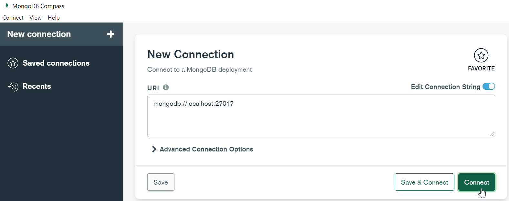
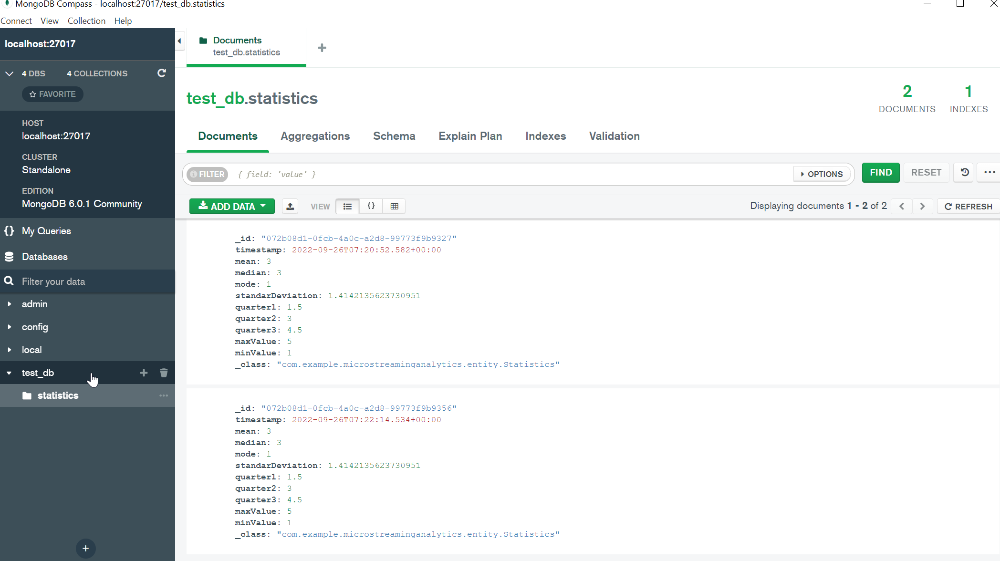

# MICRO-STREAMING-ANALYTICS

This is Spring boot application that performs readings from Rabbit queue messages and generates statistics data to save them in a Mongo database.

## Starting

This instructions will allow you to configure and start the application.

### Prerequisites
- [Docker Desktop](https://www.docker.com/products/docker-desktop)
- [MongoDB Compass](https://www.mongodb.com/try/download/compass): The GUI for MongoDB
- Internet browser

### Running the app
Before running the app you have to check that docker is running.
Open a terminal and go to the project path and execute the following command:

```
docker-compose up
```

After the app starts, in the Internet browser go to this url:  
- [RabbitMQ](http://localhost:15672/#/queues/%2F/queue1)

then in the Publish message option, insert the next Json text in the Payload field:

```
{
    "version": "7.0",
    "operation": {
        "response": {
            "timestamp": 1432454278000,
            "name": "REBOOT_EQUIPMENT",
            "id": "072b08d1-0fcb-4a0c-a2d8-99773f9b9327",
            "resultCode": "SUCCESSFUL",
            "resultDescription": "No Error.",
            "variableList": [
                {
					"name" : "variable1",
					"value" : 1
				},
				{
					"name" : "variable2",
					"value" : 6
				},
                 {
					"name" : "variable3",
					"value" : 3
				},
				{
					"name" : "variable4",
					"value" : 4
				},
				{
					"name" : "variable5",
					"value" : 3
				},
				{
					"name" : "variable5",
					"value" : 5
				}
                ],
            "steps": []
        }
    }
}
```

After that, open the MongoDbCompass and check if the save data action was performed:

Connect to the Mongo database 


Check the records selecting statistics collection from test_db
